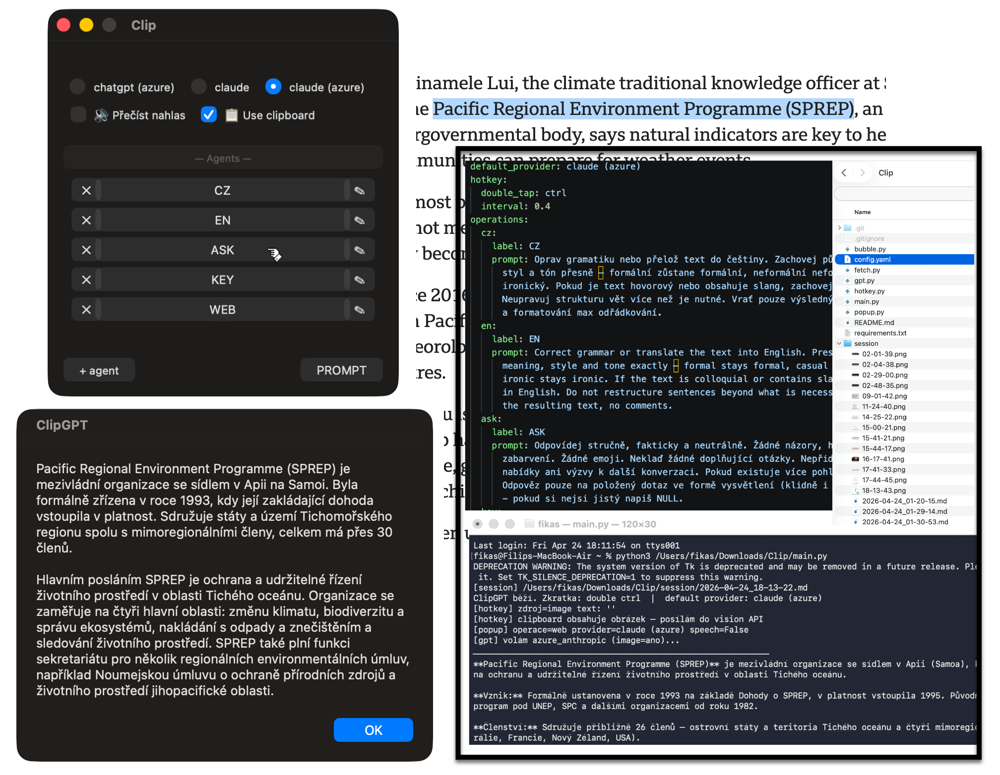

[🇨🇿 Česky](#česky) | [🇬🇧 English](#english)

---

## Česky

**Clip** je macOS nástroj, který ti klávesovou zkratkou vyvolá okno, kde si vybereš jak chceš AI použít — odpověď na e-mail, shrnutí stránky, analýza rizik, překlad nebo cokoliv vlastního. Označený text nebo obsah schránky se pošle do AI a výsledek se zkopíruje zpět do schránky.



### Funkce

- Dvojité stisknutí **Ctrl** spustí popup s výběrem operace
- Vestavěné operace:
  - **CZ** — opraví gramatiku nebo přeloží text do češtiny, zachová styl a tón originálu
  - **EN** — opraví gramatiku nebo přeloží text do angličtiny, zachová styl a tón originálu
  - **ASK** — stručná faktická odpověď na dotaz nebo vysvětlení pojmu, bez zbytečného komentáře
  - **KEY** — extrahuje klíčové informace z textu: fakta, čísla, data, závěry — každé na samostatném řádku
  - **WEB** — detekuje URL v textu, stáhne stránku a vrátí její shrnutí v češtině
- **Vlastní prompt** — tlačítko PROMPT pro libovolný dotaz
- Podpora **obrázků** ze schránky (vision API)
- Automatické stažení obsahu URL před odesláním
- Přečtení výsledku nahlas (hlas Zuzana)
- Správa operací přímo v okně (přidat / upravit / smazat)
- Logování každé session do složky `session/`
- Podpora více AI providerů: Anthropic Claude, Azure OpenAI, Azure Claude

### Instalace

**Požadavky:** macOS, Python 3.9+

```bash
pip install -r requirements.txt
cp config.yaml config.yaml.bak   # záloha
# vyplň api_key a endpoint ve config.yaml
python3 main.py
```

Při prvním spuštění je nutné povolit **Accessibility** v  
Nastavení systému → Soukromí a zabezpečení → Accessibility.

### Konfigurace

Soubor `config.yaml` obsahuje providery, hotkey a operace.

| Typ providera | Popis |
|---|---|
| `anthropic` | Přímé Anthropic API |
| `azure` | Azure OpenAI (GPT-4o) |
| `azure_anthropic` | Claude přes Azure AI Foundry |

### Použití

1. Označ text (nebo zkopíruj obrázek do schránky)
2. Dvakrát stiskni **Ctrl**
3. Vyber providera, operaci nebo napiš vlastní prompt
4. Výsledek je v schránce a zobrazí se v dialogu

---

## English

**Clip** is a macOS tool that brings up a popup with a keyboard shortcut, letting you choose how to use AI — reply to an email, summarize a page, assess risks, translate, or anything custom. Selected text or clipboard content is sent to the AI and the result is copied back to your clipboard.


### Features

- Double-tap **Ctrl** triggers the operation popup
- Built-in operations:
  - **CZ** — corrects grammar or translates text into Czech, preserving the original style and tone
  - **EN** — corrects grammar or translates text into English, preserving the original style and tone
  - **ASK** — short factual answer to a question or explanation of a term, no unnecessary commentary
  - **KEY** — extracts key information from text: facts, numbers, dates, conclusions — one per line
  - **WEB** — detects a URL in the text, fetches the page, and returns a summary in Czech
- **Custom prompt** — PROMPT button for any query
- **Image** clipboard support (vision API)
- Automatic URL fetching before sending
- Text-to-speech readout (Zuzana voice)
- Manage operations directly in the popup (add / edit / delete)
- Session logging to the `session/` folder
- Multiple AI providers: Anthropic Claude, Azure OpenAI, Azure Claude

### Installation

**Requirements:** macOS, Python 3.9+

```bash
pip install -r requirements.txt
cp config.yaml config.yaml.bak   # backup
# fill in api_key and endpoint in config.yaml
python3 main.py
```

On first run, grant **Accessibility** permission in  
System Settings → Privacy & Security → Accessibility.

### Configuration

`config.yaml` contains providers, hotkey settings, and operations.

| Provider type | Description |
|---|---|
| `anthropic` | Direct Anthropic API |
| `azure` | Azure OpenAI (GPT-4o) |
| `azure_anthropic` | Claude via Azure AI Foundry |

### Usage

1. Select text in any app (or copy an image to clipboard)
2. Double-tap **Ctrl**
3. Choose a provider, operation, or type a custom prompt
4. The result is copied to clipboard and shown in a dialog
